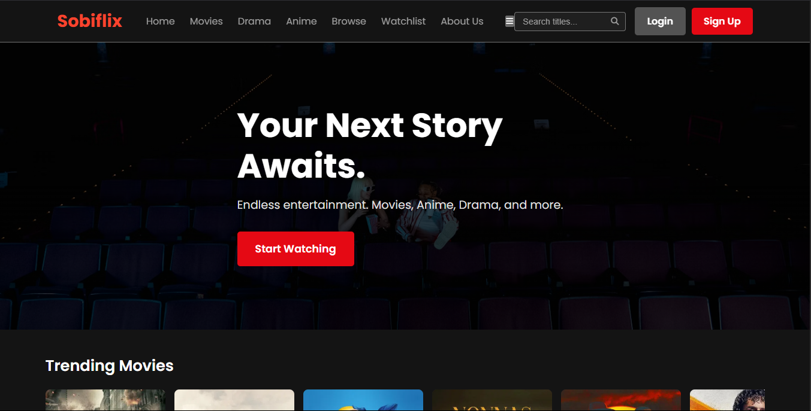

# Sobiflix 🎬

A modern streaming platform interface built with HTML, CSS, and JavaScript. Sobiflix provides a Netflix-like experience for browsing movies, TV shows, and anime.



## 🌟 Features

- **Modern UI/UX Design**
  - Responsive layout that works on all devices
  - Netflix-inspired card hover effects
  - Smooth animations and transitions
  - Dark theme for optimal viewing experience

- **Content Discovery**
  - Trending movies section
  - Now playing in theaters
  - Top-rated TV shows
  - Upcoming movies
  - Search functionality across all content

- **User Features**
  - User authentication (login/signup)
  - Watchlist functionality
  - Social media integration
  - Responsive search with instant results

- **Technical Features**
  - RESTful API integration
  - Dynamic content loading
  - Responsive design using CSS Grid and Flexbox
  - Modern JavaScript (ES6+) features
  - Font Awesome icons integration

## 🛠️ Technologies Used

- HTML5
- CSS3 (with CSS Variables, Flexbox, and Grid)
- Vanilla JavaScript (ES6+)
- RESTful APIs
- Font Awesome Icons
- Google Fonts

## 🚀 Getting Started

### Prerequisites

- A modern web browser
- Basic understanding of HTML, CSS, and JavaScript
- Local development environment

### Installation

1. Clone the repository:
   ```bash
   git clone https://github.com/itzshoaibmalik/sobiflix.git
   ```

2. Navigate to the project directory:
   ```bash
   cd sobiflix
   ```

3. Open `index.html` in your browser or use a local server:
   ```bash
   # Using Python
   python -m http.server 8000
   
   # Using Node.js
   npx serve
   ```

## 📱 Pages

- **Home** (`index.html`): Main landing page with featured content
- **Movies** (`movies.html`): Browse movies
- **TV Shows** (`tv-shows.html`): Browse TV shows
- **Anime** (`anime.html`): Browse anime content
- **Search** (`search.html`): Search results page
- **Login** (`login.html`): User authentication
- **Sign Up** (`signup.html`): New user registration
- **About** (`about.html`): Project information

## 🎨 Customization

- Colors can be modified in `css/style.css` using CSS variables
- Fonts can be changed in the CSS file
- Layout can be adjusted using the CSS Grid and Flexbox properties

## 🤝 Contributing

Contributions are welcome! Please feel free to submit a Pull Request.

1. Fork the repository
2. Create your feature branch (`git checkout -b feature/AmazingFeature`)
3. Commit your changes (`git commit -m 'Add some AmazingFeature'`)
4. Push to the branch (`git push origin feature/AmazingFeature`)
5. Open a Pull Request

## 📝 License

This project is licensed under the MIT License - see the [LICENSE](LICENSE) file for details.

## 👨‍💻 Author

**Shoaib Malik**
- GitHub: [@itzshoaibmalik](https://github.com/itzshoaibmalik)
- LinkedIn: [itzshoaibmalik](https://www.linkedin.com/in/itzshoaibmalik)
- Instagram: [by.shoaib](https://www.instagram.com/by.shoaib)

## 🙏 Acknowledgments

- Font Awesome for the icons
- Google Fonts for the typography

## 📞 Contact

For any queries or suggestions, feel free to reach out:
- Twitter: [@itzshoaibmalik](https://twitter.com/itzshoaibmalik)
- LinkedIn: [itzshoaibmalik](https://www.linkedin.com/in/itzshoaibmalik)

---

Made with ❤️ by Shoaib Malik 